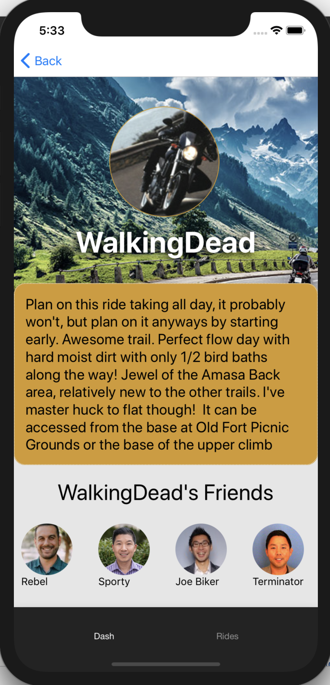

# Ride With Me

## Description

Ride With Me is an application that serves as a community board for motorcyclists to connect with other riders. Upon creation of an account, users can log in, add friends, and join rides based on criteria that they so choose, such as location, distance, and type of ride. This project features a collaborative back end API which can be viewed [here](https://gitlab.com/ryanmillergm/motorcycle_ride) and is hosted on heroku; [here](https://motorcycle-ride.herokuapp.com/graphql?query={%20allUsers%20{%20id%20firstName%20lastName%20email%20phone%20rides%20{%20title%20description%20distance%20rideCategory%20duration%20date%20imageLink%20mapLink%20}%20groups%20{%20title%20description%20}%20friends%20{%20username%20avatar%20milesRiddenTogether%20}%20}%20}) is a sample of query to get all users.

## Project Successes

MVP: As with most projects, it's easy to start with a vision that might be too large to attain in the alotted amount of time. We kept our dreams big, but made our MVP small. After figuring out what to tailor down, we decided the core, base-level functionality that would be valuable to our user was a log-in/sign-up feature, ability to create and view a profile, and the ability to view and join rides based on the user's interests. Upon log-in, we are fetching the user's profile, friends, and ride data from our back end server and rendering on a mobile screen. 

REACT NATIVE: Though this served as a challenging portion of the project, we were able to learn and implement a new JS framework, pull in and render dynamic data, and integrate Google maps from our Rides screen. 
CROSS-POL COLLAB: We had a very positive experience working alongside our two-member back end team; they worked incredibly hard to produce sample data, create and update schemas depending upon our needs, and seed a robust database to house all of our user's information. Our team communicated well, pivoted when necessary, and accomplished a final product on which we're proud to have worked.

## Project Challenges

REACT NATIVE: This was our first implementation of React Native; getting into the flow of it took a little longer than we would have hoped. Because there were a couple of moments that we got caught up in styling or getting elements to render as we were expecting, we weren't able to get as far on some of the features we were hoping to flesh out. We did however learn how to implement Redux with React Native in such a way that if given another React Native project - or more time on this project - we could speed up some of the initial setup. 
REACT NATIVE TESTING: React Native is similar to React but different enough that the knowledge is not quite transferrable. This applies to the testing as well. Fortunately there is a bit of documentation that we found helpful for some aspects of testing, but we would have liked to have more test coverage and to have produced more of a TDD application.

## Project Extensions/Issues

* Messaging capability between users
* Ability to join groups in addition to rides
* Messaging for a particular ride or group
* A more robust profile setup experience for the user to select ride criteria
* Integrate a Google maps applet onto the Rides page

## Project Tech Emphasis

* React Native
* Redux
* GraphQL with Apollo
* Expo
* X-Code/iOS Simulator

## Project Management

We used Trello for our project management needs. It was a great way to track our progress and keep ourselves on task.

## Project Comps:

### GIF

### Splash Page

### Login Modal

### Dash Page

### Friend Info Modal

### Upcoming Rides

### Updated Ride

### Map Page

## Developers

[Jev Forsberg](https://github.com/baldm0mma/); [Taylor Jordan](https://github.com/TaylorNoelJordan); [Earl Stephens](https://github.com/earl-stephens); [Ryan Miller](https://github.com/ryanmillergm)
